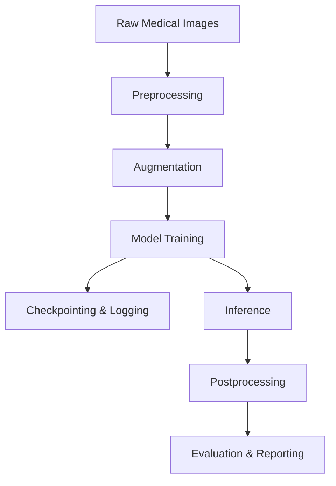

# Axon IA: Architecture Overview

## Introduction

Axon IA is a comprehensive framework for medical image segmentation, specifically focused on brain MRI analysis. The framework is designed to be modular, extensible, and easy to use, while providing state-of-the-art performance on segmentation tasks.

## System Architecture

Axon IA is organized into several key modules:

- **config**: Configuration parsing and management (YAML-based, supports overrides)
- **data**: Dataset classes, data loaders, preprocessing, augmentation, and transformation pipelines for 3D medical images
- **models**: Model architectures (UNETR, SwinUNETR, nnU-Net, SegResNet) and model factory
- **losses**: Custom loss functions for segmentation (Dice, Focal, Combo, Boundary, etc.)
- **training**: Trainer class, callbacks (early stopping, checkpointing, logging), learning rate schedulers
- **inference**: Predictors, sliding window inference, test-time augmentation, postprocessing (thresholding, connected components, etc.)
- **evaluation**: Metrics (Dice, IoU, Hausdorff, etc.), report generation, visualization utilities
- **utils**: Logging, GPU management, NIfTI utilities, visualization helpers

### High-Level Workflow

1. **Data Preparation**: Preprocess raw medical images (resampling, normalization, cropping) and organize them for training/validation/testing.
2. **Model Training**: Train segmentation models with configurable architectures, loss functions, and callbacks.
3. **Inference**: Apply trained models to new data using sliding window inference and postprocessing.
4. **Evaluation**: Compute metrics and generate reports/visualizations for model performance.

### Example Pipeline

### Extensibility
- Add new models by implementing them in `axon_ia/models/` and registering in the model factory.
- Add new loss functions in `axon_ia/losses/`.
- Customize data processing by editing or extending transforms and augmentation modules.
- Integrate new metrics or reporting tools in `axon_ia/evaluation/`.

### Scripts and Notebooks
- `scripts/prepare_data.py`: Data preprocessing
- `scripts/train.py`: Model training
- `scripts/predict.py`: Inference
- `scripts/evaluate.py`: Evaluation and reporting
- `scripts/export_model.py`: Export models to ONNX
- `notebooks/`: Example Jupyter notebooks for data prep, training, and inference

---

For more details, see the main [README](../README.md) and configuration templates in `configs/`.
